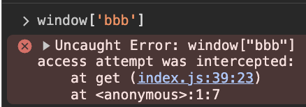
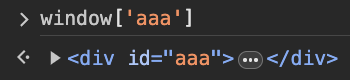

# Shield JS 🛡

Shield ([npm](https://www.npmjs.com/package/@weizman/shield)) is a tiny JavaScript shim/library that applies protection against
[DOM Clobbering attacks](https://portswigger.net/web-security/dom-based/dom-clobbering)
at runtime with close to zero integration friction.

> See for yourself - visit live [demo/playground](https://weizmangal.com/shield)

## About

Shield aspires to finally provide appropriate protection against DOM Clobbering attacks without forcing any adjustments/changes to the protected web app.

By simply including Shield as a remote script, Shield will keep an eye for new "clobberable" properties (id/name) that are introduced to the DOM.

If such are detected, Shield will redefine the window object of the application to detect and block JavaScript access to these properties, which effectively shields the window from being DOM clobbered, while allowing the app to function exactly to how it does without Shield's help.

## Installation

Include Shield via a script tag:

```html
<script src="https://cdn.jsdelivr.net/npm/@weizman/shield/shield.min.js"></script>
```

That's it. 

It's best to include it as close as possible to the beginning of the `<head>` (the earliest it runs, the better it protects).

## Usage

Shield supports optional configuration:

```html
<script src="https://cdn.jsdelivr.net/npm/@weizman/shield/shield.min.js" allowlist="id1,id2"></script>
```

* `allowlist` - a list of ids you allow to be clobbered into the DOM (shield will overlook them when applying its protection).

## Result

Shield will collect the values of all id/name properties that were introduced to DOM at runtime and will redefine
them on the `window` to throw an error when JavaScript code attempts to access them. 

That's because while we use id/name attributes for our DOM nodes, we don't expect JavaScript code to access them, so
when this happens it can only be done by a malicious entity - and that's what Shield blocks:



Unless the id/name was explicitly provided via the `allowlist` argument, which in that case Shield will allow JavaScript to access it:



Making Shield a very simple and elegant solution that requires you to do nothing but include the script in your app - **shield will do the rest!**

## About

* EXPERIMENTAL ⚠️ - Use at your own risk
* Compressed online using [https://www.toptal.com/developers/javascript-minifier](https://www.toptal.com/developers/javascript-minifier)
* By [Gal Weizman](https://weizmangal.com)
